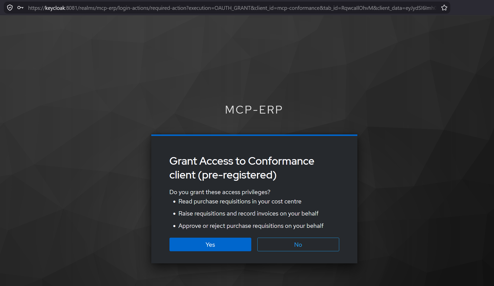
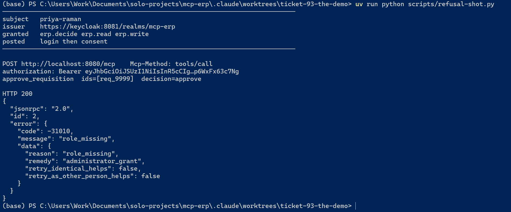
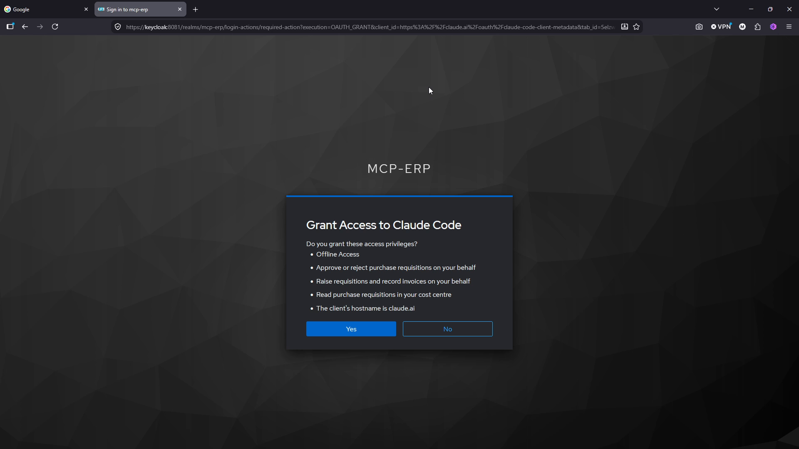

<!--
  For whoever edits this next.

  **The connective prose is hand-written and free.** ADR-0014 §What a machine
  can keep true, a machine keeps true: putting narrative inside a generator is
  how a write-up stops being written. Nothing checks a sentence here.

  **Every fenced block says where it came from.** One marker on its own line,
  immediately above the opening fence: an HTML comment reading `excerpt:` and
  then a beat name. Every fenced block below carries one, so copy the nearest
  rather than reconstructing it from a description here — an example written out
  in this note would have to contain a comment-closing sequence, which ends
  *this* comment early and spills the rest of it onto the rendered page. That
  is not hypothetical; it is what this block did until 2026-08-26.

  The name is a beat in `tests/transcripts.py`'s BEATS, and the block below it
  has to appear verbatim and contiguously in `docs/transcripts/<beat>.txt`. A
  block that is not a quotation is marked `hand-written` instead — a command the
  reader types, a fragment of configuration. There is no third option: an
  unmarked block fails `tests/test_walkthrough.py`, so the escape is always
  visible in a diff.

  Tables are **linked, never inlined** — `docs/decision-matrix/matrix.md` and
  `docs/attack-suite/scenarios.md` render from their own sources and a copy here
  would be the two-sources-one-fact drift this document is careful about. Do not
  restate a number a rendered table holds.
-->

# Walkthrough

This is the exhibit's one narrative. It walks five beats end to end, and every
wire exchange in it is an excerpt from a capture in
[`docs/transcripts/`](transcripts/) — copied, never retyped, and checked by
`tests/test_walkthrough.py`, which reads each fenced block, finds the capture it
names, and fails if those lines are not in it verbatim and contiguously. The
prose between the blocks is hand-written, and nothing checks it.

The two screenshots are illustrative. Each sits beside the transcript that
proves what it claims, and the transcript is the load-bearing half.

Bearer tokens appear in full, signature and all. They are not secrets: a
throwaway local realm minted them, its signing keys are regenerated on every
boot, and they expired five minutes after capture. Decode one and check `aud`
against what the prose around it claims.

## 1. The flow completes

The client starts with nothing. No token, no registration, no handshake.

Revision `2026-07-28` removed connection initialization entirely, so the first
thing on the wire is a real method call rather than an `initialize`. The server
answers it unauthenticated, which is deliberate: `server/discover` is the one
method that has to work before a caller knows what to ask for. It names one
protocol version and offers no cached answer:

<!-- excerpt: the-flow-completes -->
```
    "supportedVersions": [
      "2026-07-28"
    ],
    "ttlMs": 0,
```

It also answers with the rules it intends to apply, in an `instructions` string
it volunteers to every caller before any of them authenticates. Two sentences in
it are the whole of beats 3 and 4:

> The set of tools returned by `tools/list` varies with the granted scopes the
> caller's token carries; **a tool the caller may not reach is absent rather than
> refused**. Results are additionally scoped per caller, and **what is scoped
> away is omitted rather than refused**.

<details>
<summary>The full <code>instructions</code> string, as the server sent it</summary>

<!-- excerpt: the-flow-completes -->
```
    "instructions": "An MCP server exposing a mock enterprise resource planning system as a portfolio exhibit, with OAuth 2.0 as a first-class concern. Access tokens are validated locally and must be audience-bound to this resource. The set of tools returned by tools/list varies with the granted scopes the caller's token carries; a tool the caller may not reach is absent rather than refused. Results are additionally scoped per caller, and what is scoped away is omitted rather than refused.",
```

</details>

The blockquote above is the readable half of that line, and the fold holds the
line itself — one string, unbroken, as it came off the wire. The fold is what is
checked; the blockquote is prose and is not.

**One asterisk, stated where the claim is made.** This server is stateless, and
the qualification is that it is stateless on a leg it does not fully own. The
official `mcp` package serves both protocol eras from one endpoint and offers no
switch to disable the older one, so a `2025-11-25` client can still open a
session-shaped conversation here. `stateless_http=True` means no
`Mcp-Session-Id` is ever issued and nothing is remembered between requests, so
the clause is followed on both legs — but the door is inherited rather than
built, and ADR-0008 conceded it in those words: *sessions re-enter through a door
we do not control.* Row 5 of the [normative register](normative-register.md)
carries the reading.

Ask for anything else and the answer is a challenge, not a login page:

<!-- excerpt: the-flow-completes -->
```
HTTP/1.1 401 Unauthorized
connection: keep-alive
content-length: 0
date: Thu, 20 Aug 2026 21:34:55 GMT
server: nginx/1.29.4
www-authenticate: Bearer resource_metadata="http://localhost:8080/.well-known/oauth-protected-resource/mcp", scope="erp.decide erp.read erp.write"
x-served-by: 172.19.0.4:8080
```

`WWW-Authenticate` names a document rather than an authorization server, and the
client fetches it:

<!-- excerpt: the-flow-completes -->
```
{
  "resource": "http://localhost:8080/mcp",
  "authorization_servers": [
    "http://keycloak:8081/realms/mcp-erp"
  ],
  "scopes_supported": [
    "erp.decide",
    "erp.read",
    "erp.write"
  ],
  "bearer_methods_supported": [
    "header"
  ],
  "resource_documentation": "https://github.com/marcosfsousa/mcp-erp"
}
```

That is the whole of the discovery chain. One header pointed at one document,
which names the authorization server and the three scopes this resource
understands. Nothing was configured into the client.

The authorization request that follows is where this exhibit stops looking like
every other OAuth demonstration. Its query string is one 437-character line on
the wire; these are its parameters, decoded, one per row.

| Parameter | Value |
| --- | --- |
| `response_type` | `code` |
| `client_id` | `https://marcosfsousa.github.io/mcp-erp/clients/conformance/1.json` |
| `redirect_uri` | `http://127.0.0.1:8085/callback` |
| `code_challenge_method` | `S256` |
| `resource` | `http://localhost:8080/mcp` |
| `scope` | `erp.decide erp.read erp.write` |

`state` and `code_challenge` are per-request values and are in the capture.

<details>
<summary>The request line itself, as it went out</summary>

<!-- excerpt: the-flow-completes -->
```
GET /realms/mcp-erp/protocol/openid-connect/auth?response_type=code&client_id=https%3A%2F%2Fmarcosfsousa.github.io%2Fmcp-erp%2Fclients%2Fconformance%2F1.json&redirect_uri=http%3A%2F%2F127.0.0.1%3A8085%2Fcallback&state=0oo6wESfu_p-OtkGPlEWv5bRyqVa1XdaT5VOIfirYCg&code_challenge=hWV89lPCj_8nNQ3e6OmWLyDTnOQkdB1n7TKa_CEz26Q&code_challenge_method=S256&resource=http%3A%2F%2Flocalhost%3A8080%2Fmcp&scope=erp.decide+erp.read+erp.write HTTP/1.1
```

</details>

The table is hand-written and unchecked; the fold is the line the check reads.

**The `client_id` is a URL.** Not an opaque string a registration step handed
out — a document GitHub Pages serves, which Keycloak dereferences at first use
and provisions a client from. There is no client secret anywhere in this
repository because there is no client to hold one. `resource` is there too:
RFC 8707, sent because the specification asks for it independently of whether
the authorization server honours it, and Keycloak does not. Row 1 of the register
says so, and says why the resource server's own audience check is the control
that matters.

A person logs in:

<!-- excerpt: the-flow-completes -->
```
username=priya.raman&password=not-a-secret-demo-password&credentialId=
```

**That password is committed, and it is not a leaked secret.** Direct Access
Grants are disabled on every client in this realm and `password_grant_refused`
asserts the refusal, so the string cannot be exchanged for a token at the token
endpoint at all — it only works where you see it working, posted to a login form
by a browser or by a client driving one. There is no deployment; ADR-0011
declined one. And the realm is rebuilt from file into an in-memory database on
every boot, so the account it opens exists inside a container you started and
dies with it. All seven people share it, conspicuously, because seven fake
passwords would buy nothing.

A person consents:

<!-- excerpt: the-flow-completes -->
```
accept=Yes
```

Ten bytes, and they are the point of the whole beat. Everything after this is
the client acting on Priya Raman's behalf, within a ceiling she set at a screen.

The code comes back on the redirect, is redeemed with the PKCE verifier, and the
token endpoint answers:

<!-- excerpt: the-flow-completes -->
```
  "expires_in": 300,
  "refresh_expires_in": 1800,
```

Five minutes. Long enough that the published `ttlMs` cache hint means something,
short enough that the token committed in these transcripts has been worthless
since the moment of capture. Refresh tokens rotate with zero reuse, and a
replayed one revokes the grant.

Then the token is used on a real call — `list_requisitions`, fifteen rows, every
one of them CC-4100. The flow completed and the thing it authorized happened.

## 2. The three denial classes, side by side

Three refusals, three shapes, and the shape is chosen by what would fix it. That
is the whole of ADR-0002: a refusal names a remedy, so a model reading it can
tell *ask someone else* from *ask for more* from *stop asking*.

### Under-scoped: the tool is absent

Tomas Weber's token carries `erp.write` and `erp.read`. He asks for the tool
list and gets four tools. `approve_requisition` is not among them, and no error
was returned, because nothing was refused — the tool he may not reach was never
offered.

Call it anyway and the refusal arrives at the transport, before any of this
project's own policy code runs:

<!-- excerpt: under-scoped-tool-absent -->
```
HTTP/1.1 403 Forbidden
connection: keep-alive
content-length: 0
date: Thu, 20 Aug 2026 21:15:37 GMT
server: nginx/1.29.4
www-authenticate: Bearer error="insufficient_scope", error_description="the token does not carry 'erp.decide', required by 'approve_requisition'", scope="erp.decide", resource_metadata="http://localhost:8080/.well-known/oauth-protected-resource/mcp"
x-served-by: 172.19.0.5:8080
```

**Absence from a listing is not a security control**, and this is the pair that
proves it. A caller who guesses the name gets a `403` with an
`insufficient_scope` challenge that names the missing scope, the tool that
required it, and the metadata document to go and read. The listing is a
courtesy; the gate is the gate.

### Scope without role: a protocol error where a 403 would lie

This is the one worth watching, because it is performed rather than asserted.

Priya Raman holds `approver` in the realm, so the authorization server grants her
everything she asked for. Here is her consent screen, with all three capabilities
rendered as a delegation choice — the only place in this exhibit a human ever
sees them that way:



She granted `erp.decide`. The server refuses her anyway:

<!-- excerpt: scope-without-role -->
```
{
  "jsonrpc": "2.0",
  "id": 2,
  "error": {
    "code": -31010,
    "message": "role_missing",
    "data": {
      "reason": "role_missing",
      "remedy": "administrator_grant",
      "retry_identical_helps": false,
      "retry_as_other_person_helps": false
    }
  }
}
```



**The realm and the server disagree about Priya Raman on purpose.** She holds the
role in the authorization server and holds nothing at the resource server, so the
token is exactly what she consented to and the call is refused for a reason the
token cannot express. That is the point ADR-0012 exists to make: a token names a
capability an application may exercise on someone's behalf. It is never a
statement of what that person is allowed to do, and anything that treats it as
one has confused a ceiling with a permission.

The code is `-31010` at HTTP `200`, and the status code is the deliberate part.
A `403` here would say *your credential is insufficient*, and the credential is
fine — it is the person behind it who lacks the role. The remedy is
`administrator_grant`, `retry_identical_helps` is false, and
`retry_as_other_person_helps` is false as well, which is the machine-readable
form of *stop asking; this needs a human with an admin console*.

**Two things about those images, since neither is checked.** The screenshots were
taken under the opt-in TLS profile and read `https://keycloak:8081/...`, while
the transcript beside them decodes to `iss: http://keycloak:8081/...`. That is
the entire difference between the two: `tls.env` moves one variable and the
scheme is the whole diff, which is what ADR-0015 settled and what the seed
parser now enforces. And the terminal shot puts `issuer https://` two lines above
`POST http://localhost:8080/mcp`, which is not the TLS story leaking — the
profile terminates TLS at the issuer and leaves the resource identifier on plain
HTTP. Register row 2 is a deviation on both identifiers, and taking the profile
closes neither: the row is a property of the default configuration, and
`docker compose up` still brings that up.

Neither image shows her name. Keycloak's consent screen does not display the
logged-in user, so the pixels prove a consent happened and the transcript proves
whose it was.

### Segregation of duties: a domain rejection, not an authorization error

Tomas Weber again, this time holding `erp.decide` — same Person, a different
token, because the beat above needed one without it. He tries to approve
`req_0007`, which he submitted himself:

<!-- excerpt: segregation-of-duties -->
```
    "isError": true,
    "resultType": "complete",
    "structuredContent": {
      "reason": "segregation_of_duties",
      "remedy": "different_person",
      "retry_identical_helps": false,
      "retry_as_other_person_helps": true
    },
```

`isError: true` inside a successful result, at HTTP `200`, with no JSON-RPC error
object anywhere. Nothing was denied about Tomas Weber. He holds the scope, he
holds the role, he may decide requisitions, and this particular requisition is
one he may not decide because he raised it. That is a fact about a pair, not
about a caller — so it is answered by the handler after the gate chain has
already permitted the call, and it is shaped as a result rather than as an error.

`retry_as_other_person_helps: true` is the difference from the block above it. It
tells a client the wall has a door and somebody else can open it. Both separation
edges in this system answer `segregation_of_duties` — one tested against
`Requisition.submitted_by`, the other against `PurchaseOrder.approved_by` — and a
caller cannot tell them apart, deliberately. A reason names what would fix it,
and *a different person acts* is the fix for both. Inventing
`approved_this_order` would start describing the implementation to the client.

Every attack this suite defends and every clause it cites is in
[the attack suite](attack-suite/scenarios.md); every principal, tool and row is
in [the decision matrix](decision-matrix/matrix.md).

## 3. `tools/list` differs between two principals

Same server, same endpoint, same method, two tokens. Priya Raman gets five tools.
Rafael Costa gets four.

<!-- excerpt: tools-list-for-two-tokens -->
```
        "name": "approve_requisition",
```

That line is in one response and not in the other. Rafael Costa holds
`invoice_clerk` and no deciding role, so the authorization server declined
`erp.decide` and never issued it — the scope is not in his token because it was
not his to grant. The tool it guards is absent from what he is offered.

This is where role-based access control stops being a phrase. Anyone who has
integrated an API has seen a `403`. Rather fewer have watched a protocol's own
discovery method return a different set of capabilities to a different bearer of
the same endpoint, which is what makes this the exhibit's shortest complete
thought. The root [README](../README.md) carries it as its one embedded proof,
and the full exchange is in
[`tools-list-for-two-tokens.txt`](transcripts/tools-list-for-two-tokens.txt).

## 4. Row scoping

Yusuf Demir holds `approver`, exactly what Tomas Weber holds, in CC-4200 rather
than CC-4100. He exists in the cast for this one purpose: everything Tomas has,
somewhere else. His token here carries `erp.read`, and he asks for `req_0002`,
which exists, sits in CC-4100, and is not his:

<!-- excerpt: row-scoped-not-found -->
```
      "id": "req_0002"
```

Then he asks for `req_9999`, which has never existed:

<!-- excerpt: row-scoped-not-found -->
```
      "id": "req_9999"
```

Both answers are this, byte for byte:

<!-- excerpt: row-scoped-not-found -->
```
    "isError": true,
    "resultType": "complete",
    "structuredContent": {
      "reason": "not_found",
      "remedy": "none",
      "retry_identical_helps": false,
      "retry_as_other_person_helps": false
    },
```

The only difference between the two exchanges in the capture is which of the two
replicas answered. **A row in another partition and a row that was never minted
are indistinguishable at the wire**, so the read path leaks nothing about what
exists. `remedy: none`, and both retry hints are false: there is no version of
this request that works, and no person who can make it work for Yusuf Demir.

Constant time is not claimed. The property asserted is byte-identity of the
response, which is what a test over HTTP against Compose can actually establish.

**The identifiers are guessable on purpose**, and that is a `SHOULD` this project
departs from in the open. MCP's own Security Best Practices ask for
non-deterministic handles; `req_0002` is sequential and legible. Following the
clause would have deleted the proof of the half that carries the weight, because
a probe that must be *handed* a foreign identifier is no longer guessing one, and
a demonstrated defence becomes an asserted one. Register row 3 states the trade
rather than hiding it.

## 5. The recorded third-party session

Everything above was driven by clients in this repository. This beat is the one a
reader cannot call circular.

[](https://github.com/marcosfsousa/mcp-erp/releases/download/v1.0.0/recording.mp4)

[**Watch the recording**](https://github.com/marcosfsousa/mcp-erp/releases/download/v1.0.0/recording.mp4)
— 90 seconds, 1920×1080, no audio. The frame above is its poster.

Claude Code 2.1.246, launched from a checkout of this repository against a local
stack, with the protocol era pinned:

<!-- excerpt: hand-written -->
```powershell
$env:MCP_PROTOCOL_NEGOTIATION="modern"
$env:NODE_EXTRA_CA_CERTS="<checkout>\keycloak\tls\authority.crt"
claude --mcp-config demo-mcp.json --strict-mcp-config
```

`MCP_PROTOCOL_NEGOTIATION` is undocumented. It is absent from the settings page
and from the changelog, and it is what makes a shipped client speak `2026-07-28`
instead of probing and falling back. `modern` rather than `auto` because a
successful connection under `modern` *proves* the era where `auto` only indicates
it, and the take shows the detail panel reading `Protocol: 2026-07-28` on camera.

What the recording carries, in order: the launch, a Keycloak login as
`priya.raman`, the consent screen, five tools listed with `approve_requisition`
among them, a requisition submitted and then read back as a table, and a clean
exit.

**The `client_id` on that consent screen is `claude.ai`.** Anthropic's own hosted
metadata document, dereferenced by our realm, identifying Anthropic's own shipped
product. Nothing in that chain is ours except the server under test — which is
the entire reason this beat exists, and why ADR-0008 calls it the only evidence a
reader cannot call circular.

Two concessions, and both are stated here rather than left to be noticed.

**`NODE_EXTRA_CA_CERTS` is a certificate we minted, handed to the client by us.**
That is a real dent in *nothing in that chain is ours*. It is unavoidable while
the browser leg forces TLS: without it Claude Code connects on the legacy leg and
then fails the metadata fetch with `self signed certificate in certificate
chain`, which reads as a connection problem and is not one. Trusting a local
authority is a step the reader takes too, so it is at least the same step, but it
is not nothing.

**Priya Raman holds `offline_access`, and nobody else does.** Claude Code requests
that scope unconditionally, and Keycloak refuses the token request outright
without it rather than narrowing it away — `not_allowed: Offline tokens not
allowed for the user or client`. An offline token is long-lived by design and
cuts against the five-minute story in beat 1. Granting it to one Person keeps the
exception visible and argued; rotation, zero reuse and the five-minute access
token are untouched, and the realm dies with the container. ADR-0007 §*Token
lifetimes* carries the argument.

## Running it yourself: MCP Inspector

Everything above is something you can re-run. The fastest route from *I read
this* to *I ran this* is MCP Inspector 2.1.0, and the path below was executed
rather than read off its source.

**Use the command line, not the web interface.** Inspector's web interface
connects from the browser rather than through its proxy, so it sends an `Origin`
header, and this server's origin gate ships with an empty allow-list as a stated
position. The preflight is refused and the interface sits at *connecting…*
indefinitely:

<!-- excerpt: hand-written -->
```
curl -X OPTIONS http://localhost:8080/mcp -H 'Origin: http://localhost:6274'
→ 403 Forbidden    "Origin not allowed"
```

That refusal is worth more than the convenience it costs. Inspector's web
interface is a real, shipped, third-party client that sends an `Origin`, and it
is the only thing in this exhibit that exercises that gate from outside. ADR-0006
recorded that no client here sends one; that is no longer true, and the gate
holds.

**Call out the Legacy default, because it will otherwise look like a
contradiction.** An untouched Inspector speaks the older era and opens the
standalone `GET` stream the legacy leg inherits — which reads as this exhibit
contradicting its own *every POST is answered `application/json`* claim unless
you know to expect it. The instruction differs by mode, which the ticket for this
document did not anticipate. The web interface carries its own
`DEFAULT_PROTOCOL_ERA = "legacy"`. The command line and terminal interface expose
no era flag at all: they read `protocolEra` from a per-server entry in the
catalog at `~/.mcp-inspector/mcp.json`, and with it absent they inherit the
client library's `DEFAULT_VERSION_NEGOTIATION_MODE = "legacy"`. Set
`protocolEra` to `modern` on the server entry and the requests carry
`mcp-protocol-version: 2026-07-28` and the `_meta` envelope; leave it alone and
they carry neither.

Under `modern`, a full session against this server produces three requests and no
`GET` at all:

<!-- excerpt: hand-written -->
```
POST /mcp  200   786    server/discover
POST /mcp  200  8566    tools/list
POST /mcp  200  8566
```

Four more frictions, none of them fatal and all of them cheaper to know in
advance:

- **Dynamic client registration is advertised and refused.** `registration_endpoint`
  is in the discovery document; a POST to it returns `403`, because Keycloak's
  Trusted Hosts policy rejects it. Inspector's default authorization route is
  therefore closed, and you must give it either a client metadata document URL or
  a preregistered client identifier. The metadata setting is install-level, not
  per-server: `~/.mcp-inspector/storage/client.json`, under
  `cimd: {enabled, clientMetadataUrl}`, and it does nothing unless `enabled` is
  `true`.
- **Use [`public/clients/inspector/1.json`](../public/clients/inspector/1.json),
  not the conformance document.** The only thing that document decides is
  `redirect_uris`. Inspector calls back on `6274` and `6276`, the conformance
  document names `8085`, and exact-string matching refuses the difference before
  anything else happens.
- **Stored authorization state is sticky, and `--relogin` does not clear the part
  that matters.** The store is keyed by server URL and holds
  `preregisteredClientInformation`, which survives the flag. The symptom is
  `Invalid parameter: redirect_uri`, which names the wrong cause entirely. Delete
  the entry by hand.
- **The pinned beta SDK is real and inert here.** Inspector pins
  `@modelcontextprotocol/client@2.0.0-beta.5`, which predates the fix for
  401-on-probe handling: under `auto`, against a server that answers the probe
  with `401`, it falls straight back to a legacy `initialize`. Against this
  server it does not happen, because the gate chain answers `server/discover`
  unauthenticated with `200`, so the era resolves before any `401` arrives. The
  friction exists; this server does not trip it.

Node needs the authority for the TLS profile the same way Claude Code does, and
says `SELF_SIGNED_CERT_IN_CHAIN` when it lacks it. Trusting the certificate in
Firefox is a separate act from trusting it in the Windows store, and Node reads
neither.

One thing to look at while you are there. Inspector's consent screen names
`marcosfsousa.github.io` as the client hostname; the recording's Claude Code
consent screen names `claude.ai` in the same position. Same mechanism, two
different publishers, one of them not ours.

## Linked and quoted, not walked

Three things belong in this exhibit and do not belong in a scene.

**The batch call returns several independent outcomes from one request.**
`approve_requisition` takes a list, and each identifier gets its own verdict:
some approved, some refused for different reasons, in one response. It is a good
paragraph about idempotency and a poor thing to watch, and there is no stream
behind it — every modern POST here is answered `application/json`. The
[decision matrix](decision-matrix/matrix.md) holds the outcomes.

**The deviations are one honest page, not a staged moment.**
[`docs/normative-register.md`](normative-register.md) lists every `MUST`,
`MUST NOT` and `SHOULD` this project does not simply follow — three deviations
and three interpretations at the time of writing, each with the clause quoted,
what we do instead, and the ADR that decided it. Two of its rows have already
appeared above; the register is where a hostile reader should start, and it is
the strongest thing on the repository page precisely because nobody would find it
by clicking around.

**The tables render from their sources.**
[`docs/decision-matrix/matrix.yaml`](decision-matrix/matrix.yaml) is canonical
for who may do what to which row, and drives the tests, the seeded fixtures and
[its own table](decision-matrix/matrix.md).
[`docs/attack-suite/scenarios.yaml`](attack-suite/scenarios.yaml) is canonical
for the named attacks, each citing the clause it defends and recording the exact
deletion that would let it through, rendered at
[`scenarios.md`](attack-suite/scenarios.md). A table is quoted from, not
narrated, and no number from either is restated here.

## What this cost

One thing in this project's history is worth reporting plainly, because the
alternative is a portfolio piece that describes only its own good decisions.

**I specified this to the standard of a regulated system, and the specification
began generating its own work.** On 2026-08-18 the repository held thirteen
architectural decision records, a normative register, a thirty-three row attack
suite, thirteen map constraints and an eight-job continuous integration design.
It held zero lines of Python. The three governance walks before that date found
defects exclusively in the machinery and none in the design: a stale count inside
the constraint written to stop stale counts; a security property recorded as
*asserted* with nothing measuring it; an amendment convention cited seven times
and actually executed twice. Documentation was the only artifact, so
consistency-with-the-trail was the only available error signal, and that signal
is infinitely generative.

Both halves of that are load-bearing. The second defect is the reason the process
cannot be written off — a false security claim, in a committed artifact, that
nothing but a trail walk was in a position to catch, because there was no code to
fail. And the same process consumed the build window it existed to protect: the
fifty-one commits before 2026-08-18 are documentation, and everything that runs
was written in the six working days after it.

The design itself did not churn, which is the part I would want a reader to check
rather than take. Fifteen ADRs, all Accepted, none superseded and none rejected;
twelve amendments across the trail, zero of which reverse a decision. Three
vocabulary changes look like instability and are not — `already_approved` became
`already_decided` when rejection turned out to be equally terminal,
`senior_approver` became `unlimited_approver` because the role was never about
seniority, and the scope word `approve` became `decide` because `decide` is both
more accurate and domain-free. Each is a name corrected to fit a contract that
never moved.

Every figure above re-derives from the repository. As of 2026-08-26: fifteen
ADRs, six register rows, thirteen map constraints, a thirty-four row attack suite
whose `meta` block agrees with its own contents in all three dimensions, ten
continuous integration jobs where eight were designed, and a hundred and four
Python files — thirty-four under `src/`, seventy under `tests/`. Do not trust
that paragraph; `git log --date=short --format='%ad' | sort | uniq -c` and the
commands in this document's own history are faster than believing it.
